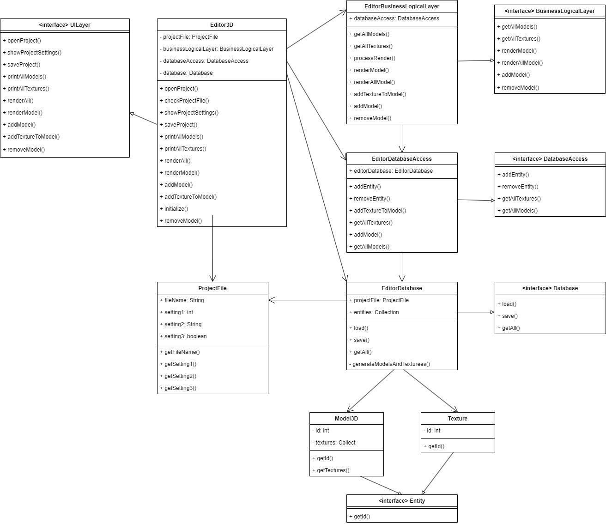

## Урок 5. Горизонтальные уровни и вертикальные срезы архитектуры
### Задание
1. Сформировать компоненты для любой системы из задания. Выпустить диаграмму компонент UML.

### Решение
1. Запуск консольной программы "Редактор 3D графики" осуществляется через файл Program.java
2. В программу добавлена возможность удалять модель данных.
3. UML диаграмма компонентов системы "Редактор 3D графики"
